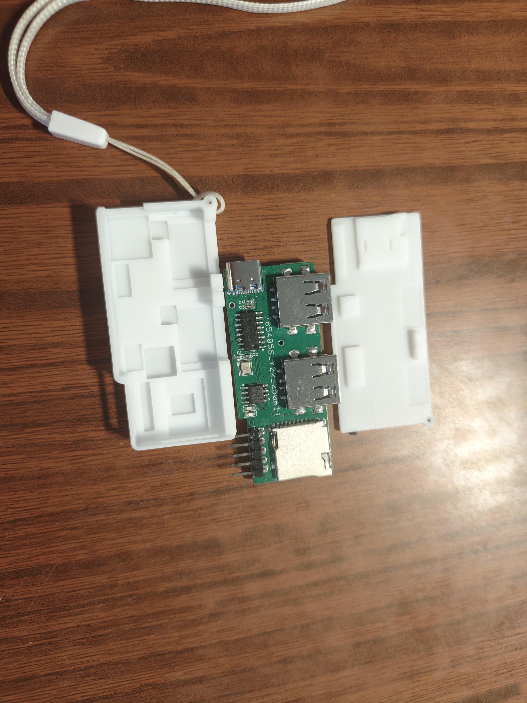
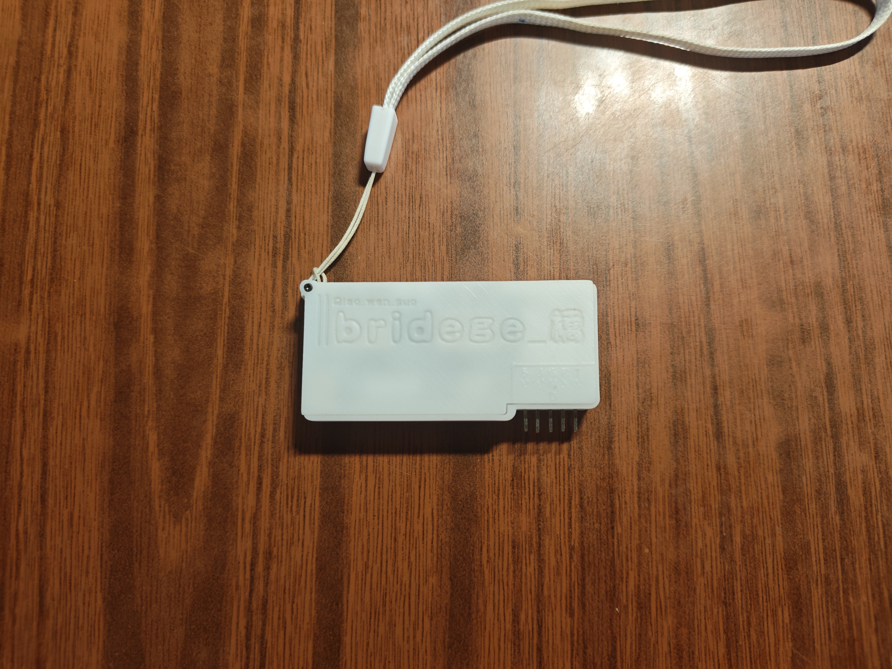
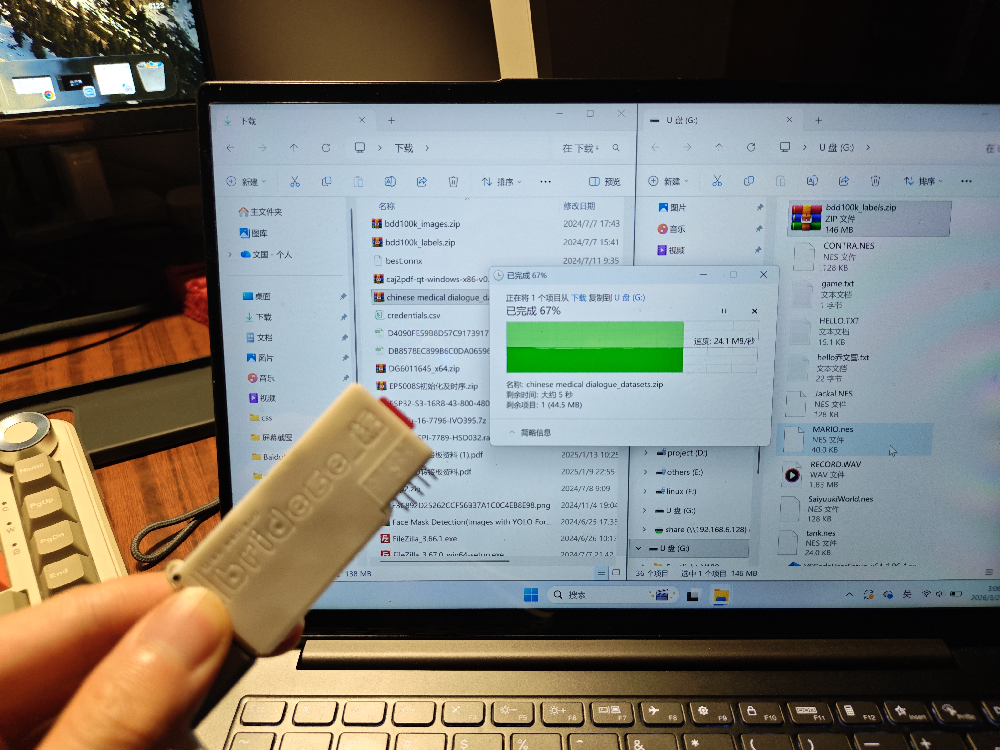

# almight-Hub 2.0

> 基于 SL2.1A 的低成本全能型 USB 2.0 HUB，集成 TF 卡读卡器 + 串口，
> 单颗方案 BOM 成本 < 6 元。—— 方便面

## ✨ 特性
- 4 口 USB 2.0 HUB（SL2.1A）
- 板载 TF 卡读卡器
- 串口（UART）引出
- 一体化 3D 打印外壳
- 成本 < 6 元

## 📐 硬件架构
\`\`\`
USB Input → SL2.1A Hub → [USB×4] [TF Card] [UART]
\`\`\`

## 🗂️ 目录说明
| 路径 | 内容 |
|---|---|
| `hardware/` | 嘉立创EDA工程、Gerber生产文件、原理图 |
| `enclosure/` | Fusion360外壳源文件 + STL打印文件 |
| `datasheet/` | 核心芯片数据手册 |
| `docs/` | BOM、组装说明、版本记录 |
| `assets/` | 渲染图、实物图 |

## 🚀 快速开始

### 直接打板/打印
- PCB：把 `hardware/gerber/` 发给PCB工厂
- 外壳：把 `enclosure/print/*.stl` 发给3D打印

### 自己修改
- PCB：嘉立创EDA专业版打开 `hardware/eda_project/ProDoc_hub_SL2.1A.epro2`
- 外壳：Fusion360 打开 `enclosure/source/going_v27.step`

嘉立创开源广场：https://oshwhub.com/qiao_wen/almight-hub-20

## 📷 展示

## 📋 BOM
详见 [docs/BOM.xlsx](docs/BOM.xlsx)

## 📄 License
GPL-3.0，详见 [LICENSE](LICENSE)