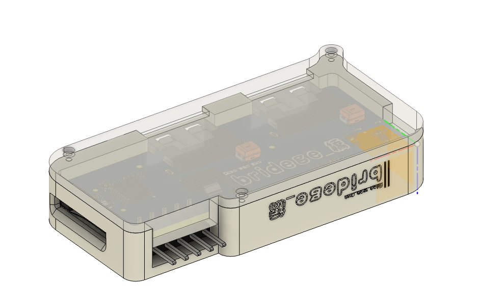
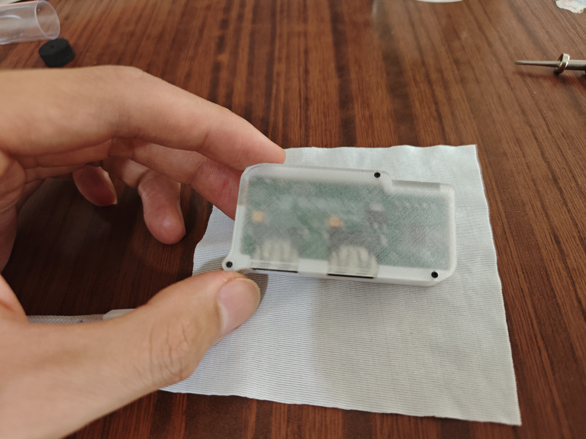
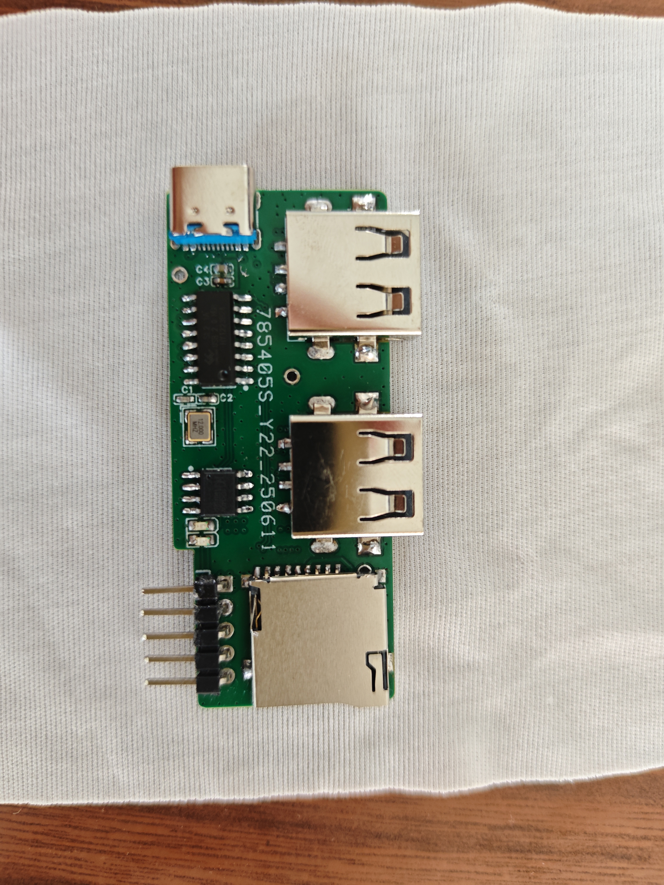
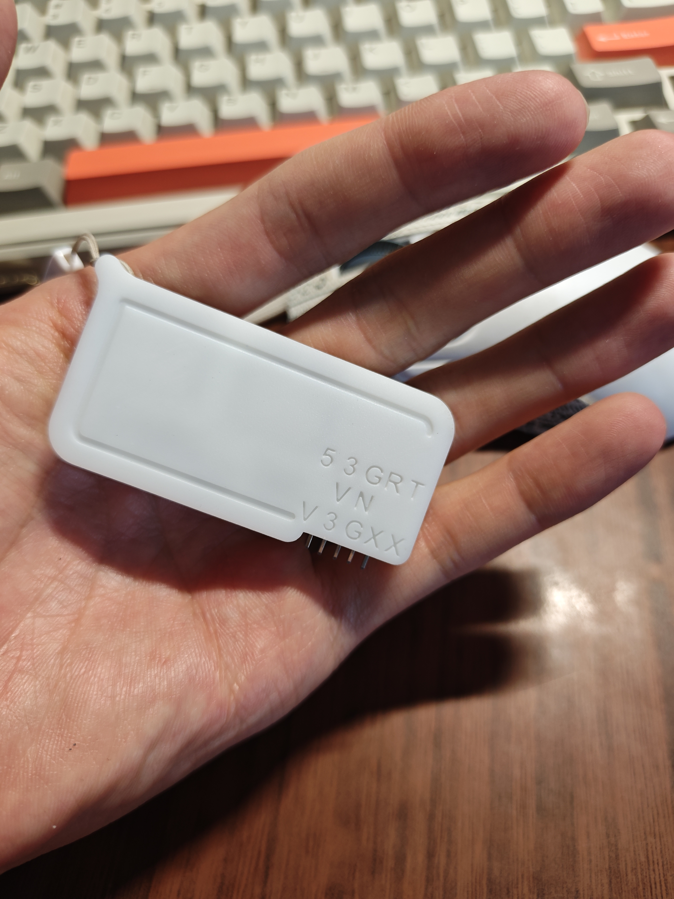
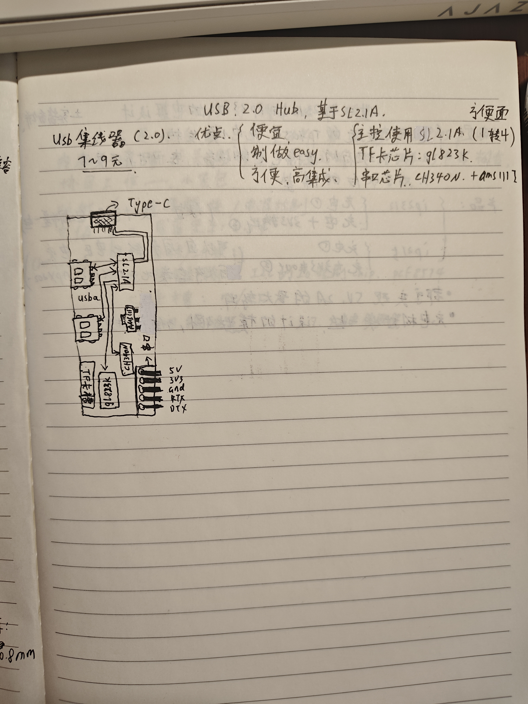
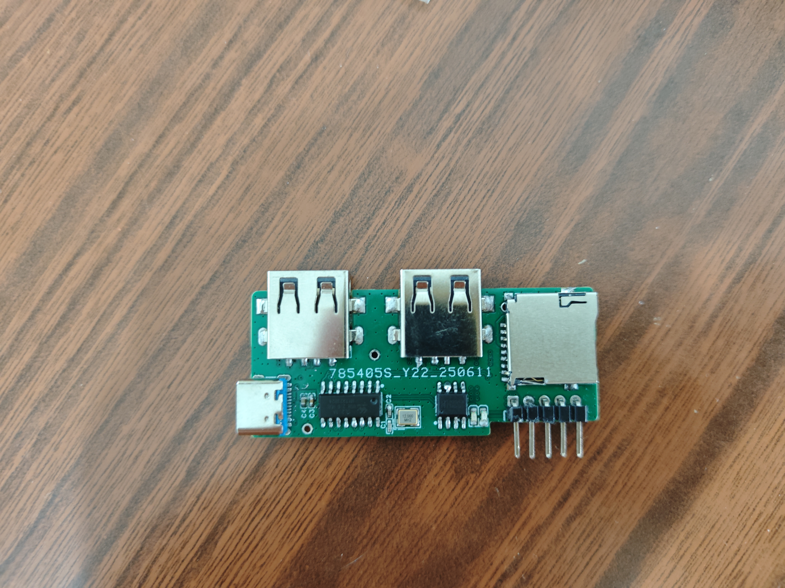
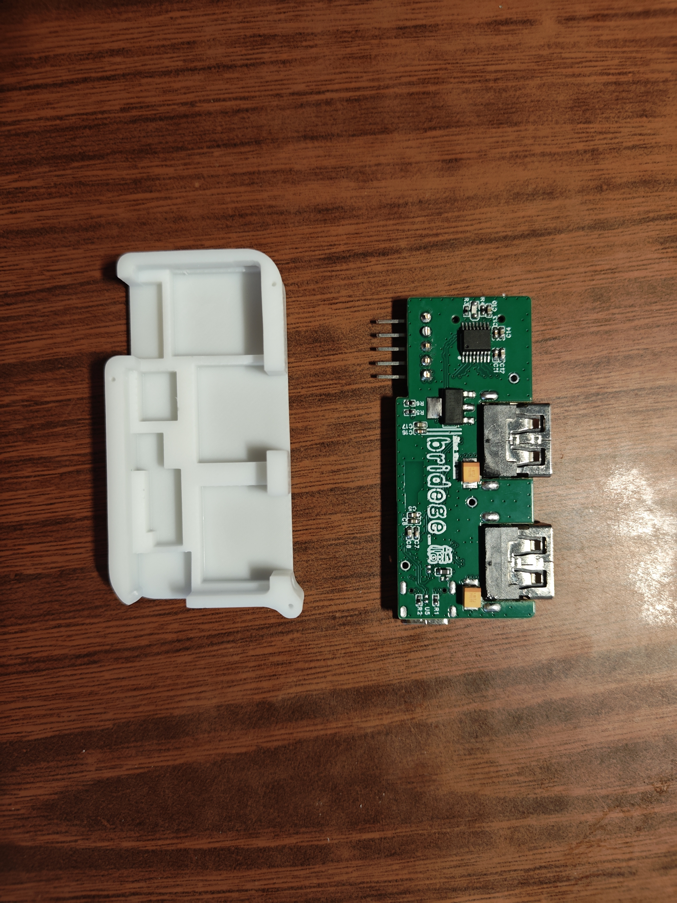
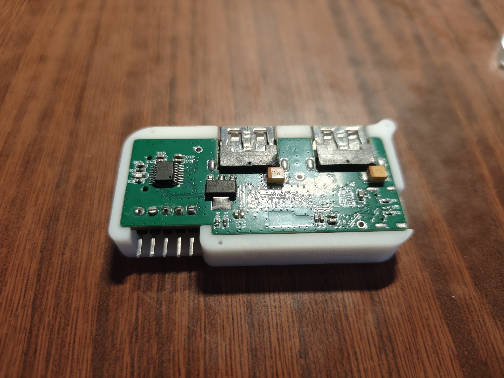
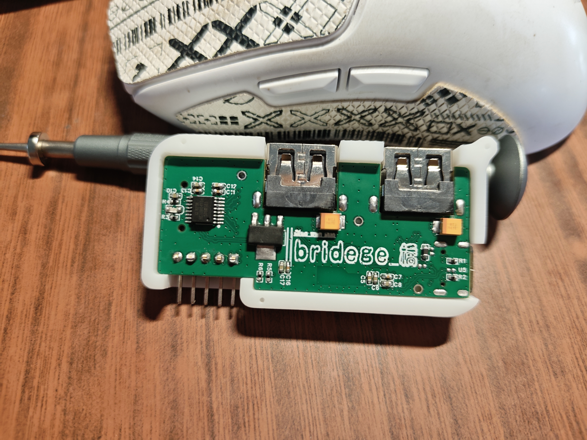
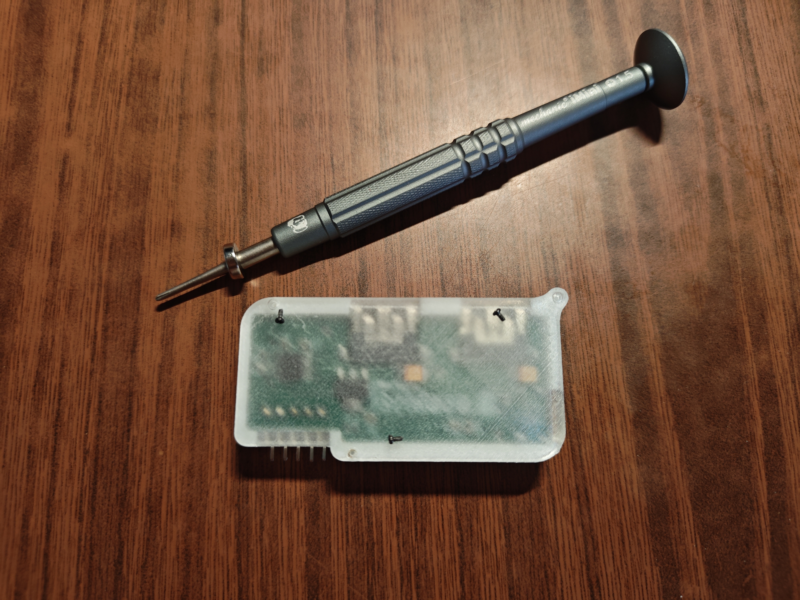

# almight-Hub 2.0

在面对普通场景下（键鼠、打印机、tf卡等）usb2.0的使用更加频繁，传统的usb2.0的hub功能单一，并不能应对更加复杂的场景。因此有了该项目——基于SL2.1A的全能型hub，能更好的应对接口扩展与转化、读取tf卡、串口的实现,更加重要的是其制作成本很少。
>——方便面

## ✨ 特性
- 4口USB 2.0 HUB：基于SL2.1A芯片，稳定可靠
- TF卡读卡器：板载TF卡座，即插即用
- 串口（UART）引出：方便调试与开发
- 一体化3D打印外壳：结构紧凑，即插即用

## 📐 硬件架构
\`\`\`
USB Input → SL2.1A Hub → [USB×2]+[TF Card]+[UART]
\`\`\`

## 🗂️ 目录说明
| 路径 | 内容 |
|---|---|
| `hardware/` | 嘉立创EDA工程、Gerber生产文件、原理图 |
| `enclosure/` | Fusion360外壳源文件 + STL打印文件 |
| `datasheet/` | 核心芯片数据手册 |
| `docs/` | BOM、组装说明、版本记录 |
| `assets/` | 渲染图、实物图 |

## 🚀 快速开始

### 直接打板/打印
- PCB：把 `hardware/gerber/` 发给PCB工厂
- 外壳：把 `enclosure/print/*.stl` 发给3D打印

### 自己修改
- PCB：嘉立创EDA专业版打开 `hardware/eda_project/ProDoc_hub_SL2.1A.epro2`
- 外壳：Fusion360 打开 `enclosure/source/going_v27.step`

嘉立创开源广场：https://oshwhub.com/qiao_wen/almight-hub-20

## 📷 展示组装过程

## 📋 BOM
详见 [docs/BOM_hub_SL2.1A.csv](docs/BOM_hub_SL2.1A.csv)

## 📄 License
GPL-3.0，详见 [LICENSE](LICENSE)